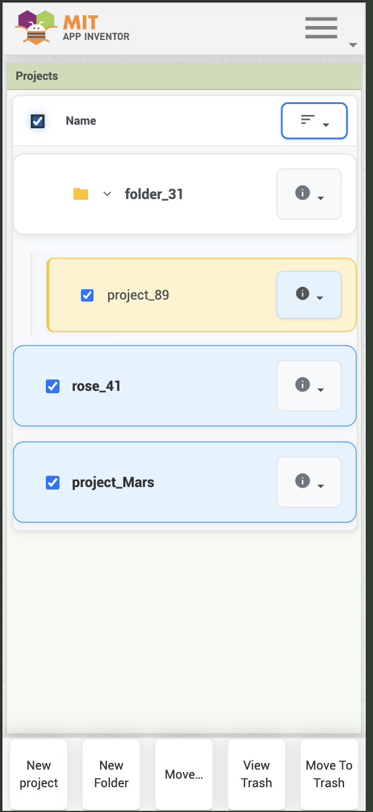

  

    
    

  

  

# Responsive (Mobile phone Layout)

## Student Info

- Name: Divyanshu Kumar
- Email: kumardivyanshu118@gmail.com
- GitHub Profile: https://github.com/d1vyanshu-kumar

## Mentors Info
- Susan Lane

## Project Abstract

App Inventor has refactored its user interface using GWT’s UiBinder framework to support multiple layouts tailored to devices or user preferences, addressing the growing number of users accessing the platform via mobile phones—which are far more accessible globally than desktops or laptops. The primary goal is to develop a mobile-optimized UI that adapts seamlessly to small screens while preserving all core functionalities, such as the blocks editor and designer

## My Role and Approach

My role is to enhance mobile usability by designing and implementing a responsive UI option that keeps all essential features intact, drawing from the current desktop layout while optimizing for touch-friendly, space-efficient interactions. To visualize this, I've created a Figma prototype that reimagines the interface for small screens—adapting dense desktop components into streamlined, intuitive mobile views without losing functionality. You can explore it here:
[Mobile UI Prototype](https://www.figma.com/design/mD31gUR4hkck4i3FFXV9X3/Ai-mobile?node-id=0-1&t=sL5eJuD0CZX3Xbp1-0)

## Project Links
- #### [GSoC Project Proposal](https://docs.google.com/document/d/1vZSDBjJ7LFv2_Jxhyosmn_Ay_C9iIAPK_8hSZeWQFgo/edit?usp=sharing)

- #### [GSoC Project Page](https://summerofcode.withgoogle.com/programs/2025/projects/mW5rZglq)

- #### Single Pull Request for entire project
  [Implementing Mobile-Responsive Layout for App Inventor](https://github.com/mit-cml/appinventor-sources/pull/3491)  

- #### GitHub Organization Repo
  [MIT App Inventor](https://github.com/mit-cml/appinventor-sources)

- #### GitHub Forked Repo
  [MIT App Inventor](https://github.com/d1vyanshu-kumar/appinventor-sources)

# Work Summary

This section outlines the key accomplishments in making MIT App Inventor's interface fully responsive for mobile devices, ensuring optimal usability across different screen sizes while preserving all core functionality.

## Completed Features

###  Project Dashboard (Projects & Trash Views)
Transformed the Project Explorer into a fully responsive interface by integrating dropdown menu buttons, tab bars, and mobile-friendly navigation elements. Users can now efficiently manage their projects on small screens without UI clutter.

   
    
  

###  Designer Interface
Redesigned the layout with an intuitive structure featuring:
- **Menu Bar & Title Bar**: Includes back button, screen dropdown, and three-dot menu for additional options
- **Central Viewer**: Optimized drag-and-drop area for component placement
- **Fixed Tab Bar**: Bottom navigation that opens relevant side panels for tools and properties

This configuration maximizes screen real estate while maintaining touch-friendly interactions on mobile devices.

   
    

###  Blockly Editor
Enhanced the visual programming workspace with comprehensive mobile optimizations:
- **Responsive Title Bar**: Clean header with essential navigation controls
- **Touch-Optimized Viewer**: Improved drag-and-drop mechanics designed for finger interactions
- **Enhanced Tab System**: Streamlined access to block categories and workspace tools
- **Gesture Support**: Intuitive touch gestures for zooming, panning, and block manipulation

These improvements make visual programming feel natural and efficient on mobile devices.

   
  
  

---

*All interfaces maintain full functionality while adapting seamlessly to various screen sizes, ensuring MIT App Inventor remains accessible and user-friendly across all devices.*

## Remaining Work

The following items require completion to finalize the mobile-responsive implementation for MIT App Inventor:

###  Pending Implementation

#### SimpleVisible Component Panel
- **Task**: Implement the SimpleVisible component panel specifically optimized for mobile devices
- **Status**: Not yet started

#### CSS Refactoring & Optimization
- **Task**: Refactor and optimize CSS styling across various UI components
- **Details**: Some components need additional mobile-specific styling improvements to ensure consistent appearance and behavior
- **Status**: Requires targeted refinement in specific areas

#### YaBlockEditor Mobile Optimization
- **Task**: Complete refactoring of the YaBlockEditor for mobile compatibility
- **Current Issue**: Mobile optimizations are inadvertently affecting the desktop UI experience
- **Status**: In progress - Needs isolation between mobile and desktop implementations

###  Next Steps

1. **Isolate Mobile Changes**: Ensure all mobile optimizations use proper media queries and don't interfere with desktop layouts
2. **Component Testing**: Thoroughly test the SimpleVisible panel across different mobile devices and screen sizes
3. **Cross-Platform Validation**: Verify that desktop functionality remains unaffected by mobile enhancements
4. **Performance Optimization**: Fine-tune CSS for optimal loading and rendering on mobile devices

---

*These remaining tasks will complete the mobile-responsive transformation while maintaining the robust desktop experience that users expect.*
 
